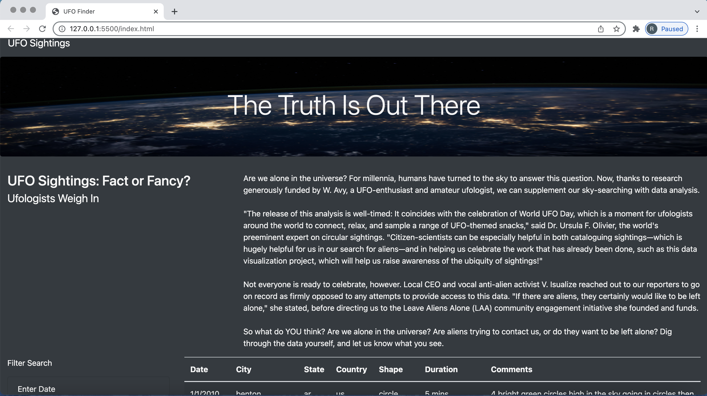
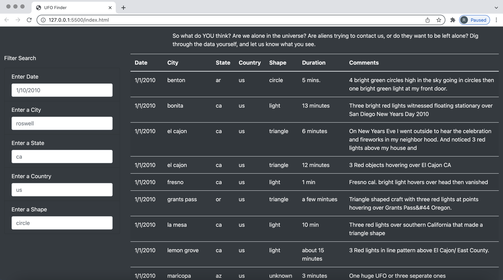

# UFOs
## Background
> Cliente webpage and dynamic table are working as intended, but she’d like to provide a more in-depth analysis of UFO sightings by allowing users to filter for multiple criteria at the same time. In addition to the date, you’ll add table filters for the city, state, country, and shape.

### Resources
* Software: HTML/CSS, JavaScript, Visula Studio Code, BootStrap
## Overview
> Deliverable 1: Filter UFO sightings on multiple criteria

> Deliverable 2: A written report on the UFO analysis (README.md)
### Deliverable 1:
> 1. Download the ufo_starterCode.js, rename it app.js, and place it in the js folder of your UFOs GitHub repository. The starter code includes the code used to populate the table from this module.
> 2. In the index.html file, remove the list (<li></li>) element that creates the button.

> 3. Create four more list elements: city, state, country, and shape. These will be similar to the "Enter Date" list element. Each element should have the same "id" as the object properties in the data.js file.
> 4. Create an empty filters variable to keep track of all the elements that change when a search is entered. This variable will be used in Step 5 to store the property “id” and the value that was entered from user input.
> 5. Next, you will need to write code for two functions whose names we’ve provided in the starter code, updateFilters() and filterTable().
    - The updateFilters() function will replace your handleClick() function and update the filters variable you created in Step 1.
    - The filterTable() function will filter the table data by the value that is entered for the "id" that has changed.
> 6. Located before the buildTable(tableData) function at the end of the starter code, modify the event listener from this module so that it detects a "change" on each input element and calls the updateFilters() function.
> 7. We’ve provided the function, updateFilters(). Inside this function, you’ll write code in Steps 4-5 to update the filters based on user input.
> 8. In Step 4a, create a variable that saves the element that was changed using d3.select(this).
> 9. In Step 4b, create a variable that saves the value of the changed element’s property.
> 10. In Step 4c, create a variable that saves the attribute of the changed element’s id.
> 11. In Step 5, write an if-else statement that checks if a value was changed by the user (variable from Step 4b).If a value was changed, add the element’s id (variable from Step 4c) as the property and the value that was changed to the filters variable you created in Step 1. If a value was not entered, then clear the element id from the filters variable.
> 12. Inside the updateFilters() function, call the filterTable() function that will be used in Step 7.
> 13. In the filterTable() function in Step 7, write code to filter the table based on the user input that is stored in the filters variable.
> 14. Create a variable for the filtered data that is equal to the data that builds the table. This variable will hold the updated table data based on the user input.
> 15. Loop through the filters object and store the data that matches the filter values in the variable created in Step 8.
> 16. Rebuild the table with the filtered data by passing the variable created in Step 8.
> 17. Deploy the web app on your GitHub pages.

## Results

*Search Procedure:*

This is the page where you will first be directed pnce accessing the webpage.
By clicking on the navbar(UFOs Sighting) at the top left corner of the webpage a user can re-initialize the page. As shown by the image below.

*Filtering the Table:*

The user will be able to filter the table by, date, city,country,state and shape.
once the filters have been applied the table will adjust accordingly.

### Summary
### Drawbacks:

1. One drawback of this webpage is that it does not have a clear button to clear the filters.
2. Another drawback is that the table is not able to be filtered by key words in the comments column.

### Recommendations:

1. I would recommend to add a clear filter button, along with new parameters allowing for capital letters.
2. Also, it would be beneficial to add a function to the date range allowing the table to be filtered by month as well as days.
